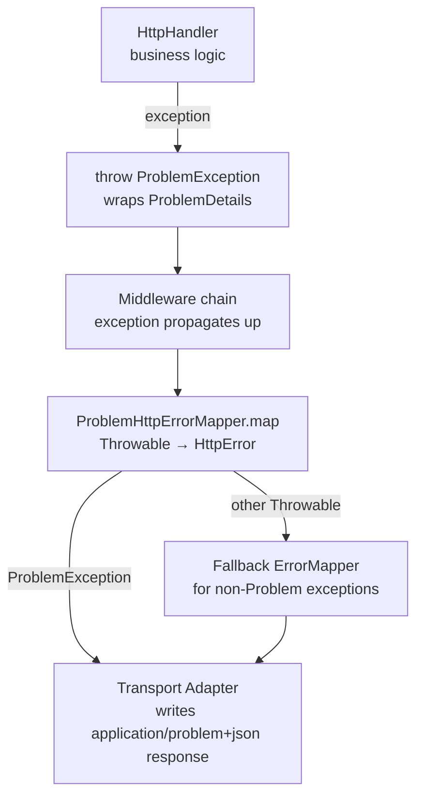

# ether-http-problem

RFC 9457 (formerly RFC 7807) Problem Details for HTTP APIs — immutable model, fluent builder, typed exception, and a bridge to `ether-http-core`'s error mapping pipeline.

## Maven Dependency

```xml
<dependency>
    <groupId>dev.rafex.ether.http</groupId>
    <artifactId>ether-http-problem</artifactId>
    <version>8.0.0-SNAPSHOT</version>
</dependency>
```

## Overview

When something goes wrong in an HTTP API, clients should receive a structured, machine-readable error document rather than an opaque string. RFC 9457 standardises this with the `application/problem+json` media type.

`ether-http-problem` provides:

- **`ProblemDetails`** — an immutable record that models the RFC 9457 problem document.
- **`ProblemDetails.Builder`** — a fluent builder for constructing problem documents.
- **`ProblemException`** — a `RuntimeException` that carries a `ProblemDetails` instance.
- **`ProblemHttpErrorMapper`** — an `ErrorMapper` implementation that unwraps `ProblemException` into an `HttpError`, bridging the problem model to `ether-http-core`.
- **`ProblemJsonSupport`** — serialisation helpers for rendering problems as JSON.

---

## What a Problem Details Response Looks Like

A `404 Not Found` response with Problem Details:

```http
HTTP/1.1 404 Not Found
Content-Type: application/problem+json

{
  "type":     "https://example.com/problems/user-not-found",
  "title":    "User Not Found",
  "status":   404,
  "detail":   "No user exists with id '42'.",
  "instance": "/users/42"
}
```

A `422 Unprocessable Entity` response with validation errors in the `properties` extension map:

```http
HTTP/1.1 422 Unprocessable Entity
Content-Type: application/problem+json

{
  "type":   "https://example.com/problems/validation-failed",
  "title":  "Validation Failed",
  "status": 422,
  "detail": "The request body failed validation.",
  "errors": [
    { "field": "email",  "message": "must be a valid email address" },
    { "field": "age",    "message": "must be a positive integer" }
  ]
}
```

The `type` URI acts as a stable identifier that clients can use for programmatic error handling. `title` is human-readable and should not change between responses of the same type. `detail` is a human-readable sentence describing this specific occurrence.

---

## Exception Flow



The transport adapter wraps the entire pipeline in a try-catch. When an unhandled exception reaches the adapter, it calls `ErrorMapper.map(throwable)`. `ProblemHttpErrorMapper` checks whether the exception is a `ProblemException`; if so, it extracts the status, code, and message from the wrapped `ProblemDetails` and returns an `HttpError`. Non-`ProblemException` throwables are delegated to a configurable fallback mapper (defaulting to `DefaultErrorMapper`).

---

## API Reference

### `ProblemDetails`

An immutable record with the following fields:

| Field | Type | RFC 9457 field | Default |
|---|---|---|---|
| `type` | `URI` | `type` | `about:blank` |
| `title` | `String` | `title` | `"Unknown problem"` |
| `status` | `int` | `status` | — |
| `detail` | `String` | `detail` | `""` |
| `instance` | `URI` | `instance` | `null` |
| `properties` | `Map<String, Object>` | extension members | `{}` |

The `properties` map holds any extension members (e.g. `errors`, `code`, `traceId`). Its contents are serialised as top-level fields alongside the standard ones.

### `ProblemException`

A `RuntimeException` that wraps a `ProblemDetails`. Throw it from any handler or service layer; `ProblemHttpErrorMapper` will catch and translate it automatically.

### `ProblemHttpErrorMapper`

Implements `ErrorMapper` from `ether-http-core`. It checks `instanceof ProblemException` first; all other throwables fall through to the fallback.

---

## Examples

### 1. Create a `ProblemDetails` for 404 Not Found

```java
import dev.rafex.ether.http.problem.model.ProblemDetails;
import java.net.URI;

// Quick factory for simple cases:
var notFound = ProblemDetails.of(404, "User Not Found", "No user exists with id '42'.");

// Equivalent using the fluent builder:
var notFoundFull = ProblemDetails.builder()
    .type(URI.create("https://api.example.com/problems/user-not-found"))
    .title("User Not Found")
    .status(404)
    .detail("No user exists with id '42'.")
    .instance(URI.create("/users/42"))
    .build();

System.out.println(notFoundFull.status());   // 404
System.out.println(notFoundFull.title());    // "User Not Found"
System.out.println(notFoundFull.instance()); // /users/42
```

---

### 2. Create a `ProblemDetails` with extension properties (validation errors)

```java
import dev.rafex.ether.http.problem.model.ProblemDetails;
import java.net.URI;
import java.util.List;
import java.util.Map;

// Java 21 record for a single validation error entry.
record FieldError(String field, String message) {}

var validationErrors = List.of(
    new FieldError("email", "must be a valid email address"),
    new FieldError("age",   "must be a positive integer")
);

var problem = ProblemDetails.builder()
    .type(URI.create("https://api.example.com/problems/validation-failed"))
    .title("Validation Failed")
    .status(422)
    .detail("The request body failed validation.")
    .instance(URI.create("/users"))
    .property("errors", validationErrors)        // extension field
    .property("code",   "VALIDATION_FAILED")     // machine-readable error code
    .property("traceId", "abc-123-def-456")      // observability hook
    .build();

System.out.println(problem.properties().get("code"));    // "VALIDATION_FAILED"
System.out.println(problem.properties().get("errors"));  // List of FieldError records
```

The `properties` map is serialised by `ProblemJsonSupport` as top-level JSON fields, meaning the JSON output will contain `"errors": [...]` alongside `"type"`, `"title"`, etc.

---

### 3. Throw `ProblemException` from a handler

```java
import dev.rafex.ether.http.core.HttpExchange;
import dev.rafex.ether.http.core.HttpHandler;
import dev.rafex.ether.http.problem.exception.ProblemException;
import dev.rafex.ether.http.problem.model.ProblemDetails;
import java.net.URI;
import java.util.Map;

public final class UserHandler implements HttpHandler {

    private final UserRepository repository;

    public UserHandler(UserRepository repository) {
        this.repository = repository;
    }

    @Override
    public boolean handle(HttpExchange exchange) throws Exception {
        var id = exchange.pathParam("id");

        var user = repository.findById(id).orElseThrow(() ->
            new ProblemException(
                ProblemDetails.builder()
                    .type(URI.create("https://api.example.com/problems/user-not-found"))
                    .title("User Not Found")
                    .status(404)
                    .detail("No user exists with id '" + id + "'.")
                    .instance(URI.create(exchange.path()))
                    .build()
            )
        );

        exchange.json(200, user);
        return true;
    }
}

// Handler for insufficient permissions:
public final class AdminHandler implements HttpHandler {

    @Override
    public boolean handle(HttpExchange exchange) throws Exception {
        var role = exchange.queryFirst("role"); // from auth context in real usage

        if (!"ADMIN".equals(role)) {
            throw new ProblemException(
                ProblemDetails.builder()
                    .type(URI.create("https://api.example.com/problems/forbidden"))
                    .title("Forbidden")
                    .status(403)
                    .detail("Only administrators may access this endpoint.")
                    .instance(URI.create(exchange.path()))
                    .property("requiredRole", "ADMIN")
                    .property("actualRole",   role)
                    .build()
            );
        }

        exchange.json(200, Map.of("admin", "data"));
        return true;
    }
}
```

---

### 4. Configure `ProblemHttpErrorMapper` in a server

```java
import dev.rafex.ether.http.problem.mapper.ProblemHttpErrorMapper;
import dev.rafex.ether.http.core.ErrorMapper;
import dev.rafex.ether.http.core.DefaultErrorMapper;
import dev.rafex.ether.http.core.HttpError;

// ProblemHttpErrorMapper uses DefaultErrorMapper as its fallback out of the box.
ErrorMapper errorMapper = new ProblemHttpErrorMapper();

// Or supply a custom fallback for non-Problem exceptions:
ErrorMapper customFallback = error -> switch (error) {
    case IllegalArgumentException iae ->
        new HttpError(400, "bad_request", iae.getMessage());
    case SecurityException se ->
        new HttpError(403, "forbidden", "Access denied");
    default ->
        new HttpError(500, "internal_error", "An unexpected error occurred");
};

ErrorMapper composedMapper = new ProblemHttpErrorMapper(customFallback);

// How the transport adapter uses it (pseudo-code):
try {
    handler.handle(exchange);
} catch (Exception ex) {
    var httpError = composedMapper.map(ex);
    // The Jetty/Netty adapter writes a problem+json response using httpError.status().
    exchange.json(httpError.status(), buildProblemResponse(httpError, exchange.path()));
}
```

---

### 5. Using `ProblemDetails` with a service layer

A common pattern is to define domain-specific problem factories and throw `ProblemException` from the service, keeping the handler thin.

```java
import dev.rafex.ether.http.problem.exception.ProblemException;
import dev.rafex.ether.http.problem.model.ProblemDetails;
import java.net.URI;
import java.util.List;

// Centralised problem factory for the Users domain.
public final class UserProblems {

    private UserProblems() {}

    public static ProblemException notFound(String id) {
        return new ProblemException(ProblemDetails.builder()
            .type(URI.create("https://api.example.com/problems/user-not-found"))
            .title("User Not Found")
            .status(404)
            .detail("No user exists with id '" + id + "'.")
            .build());
    }

    public static ProblemException emailAlreadyTaken(String email) {
        return new ProblemException(ProblemDetails.builder()
            .type(URI.create("https://api.example.com/problems/email-taken"))
            .title("Email Already Taken")
            .status(409)
            .detail("The email address '" + email + "' is already registered.")
            .property("email", email)
            .build());
    }

    public static ProblemException validationFailed(List<?> errors) {
        return new ProblemException(ProblemDetails.builder()
            .type(URI.create("https://api.example.com/problems/validation-failed"))
            .title("Validation Failed")
            .status(422)
            .detail("One or more fields failed validation.")
            .property("errors", errors)
            .build());
    }
}

// Service layer throws domain problems — no HTTP knowledge required here.
public final class UserService {

    public User getUser(String id) {
        return repository.findById(id).orElseThrow(() -> UserProblems.notFound(id));
    }

    public User createUser(CreateUserRequest req) {
        if (repository.existsByEmail(req.email())) {
            throw UserProblems.emailAlreadyTaken(req.email());
        }
        return repository.save(req);
    }
}

// Handler is thin — it just calls the service and the exception propagates.
public final class CreateUserHandler implements HttpHandler {

    private final UserService userService;

    public CreateUserHandler(UserService userService) {
        this.userService = userService;
    }

    @Override
    public boolean handle(HttpExchange exchange) throws Exception {
        // Deserialise request body (transport-specific helper shown conceptually).
        var req = readJson(exchange, CreateUserRequest.class);
        var user = userService.createUser(req); // may throw ProblemException
        exchange.json(201, user);
        return true;
    }
}
```

---

### 6. Render `ProblemDetails` as JSON manually

```java
import dev.rafex.ether.http.problem.json.ProblemJsonSupport;
import dev.rafex.ether.http.problem.model.ProblemDetails;
import java.net.URI;

var problem = ProblemDetails.builder()
    .type(URI.create("https://api.example.com/problems/rate-limited"))
    .title("Too Many Requests")
    .status(429)
    .detail("Rate limit exceeded. Retry after 60 seconds.")
    .property("retryAfterSeconds", 60)
    .build();

// Render as compact JSON:
String json = ProblemJsonSupport.toJson(problem);

// Render as pretty-printed JSON:
String pretty = ProblemJsonSupport.toPrettyJson(problem);

// The content-type to set on the response:
String contentType = "application/problem+json";

// In a handler, write the response directly:
exchange.json(problem.status(), problem);
// The transport adapter will serialise ProblemDetails as JSON using ether-json.
```

---

## Design Notes

- **`type` URI stability.** The `type` URI is a stable identifier; clients bookmark it to decide how to handle specific error kinds. Changing a type URI is a breaking change.
- **`about:blank` default.** When `type` is not set, the constructor defaults to `about:blank`, which RFC 9457 treats as "no additional semantics beyond the status code."
- **Extension properties are top-level.** The `properties` map is serialised as flat JSON fields alongside the standard five. This matches the RFC's intent for extension members.
- **`ProblemException` is unchecked.** Service methods do not need to declare it in their `throws` clause. The transport adapter catches all `Exception` subtypes at the outermost layer.

---

## License

MIT License — Copyright (C) 2025-2026 Raúl Eduardo González Argote
